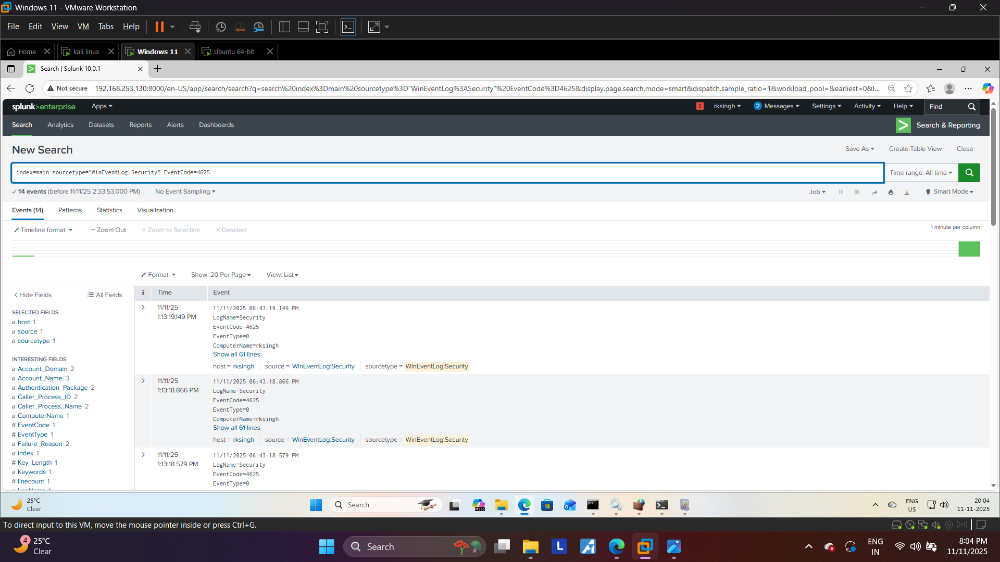

 # 🛡️ Project 2: RDP Brute Force Detection using Splunk

## 🎯 Objective
This project demonstrates the setup of an End-to-End **SIEM (Security Information and Event Management)** pipeline to detect a credential brute-force attack on a Windows machine.

## ⚙️ Tools and Environment
* **Attacker:** Kali Linux VM (Hydra Tool)
* **Victim/Log Source:** Windows 11 VM
* **Log Collector:** Splunk Universal Forwarder
* **SIEM/Analysis:** Splunk Enterprise Server

## 🚀 Attack Execution
The Hydra tool was used to launch a Brute Force attack against the Windows 11 Remote Desktop Protocol (RDP) service on port **3389**.

### Hydra Command:
```bash
hydra -l Administrator -P /usr/share/wordlists/rockyou.txt rdp://192.168.253.131 -t 4 -f -V


### 🖥️ Attack Command Proof


                               (images/kali_hydra_attack2.png)
                                
---

### 🔎 Detection Proof


                                     (images/splunk_brute_force_detection2.png)                                                 